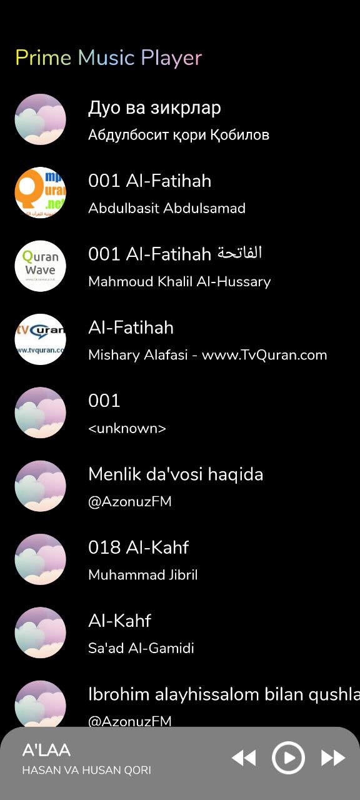

# PrimeMusicPlayer - Android App

Welcome to the **PrimeMusicPlayer** repository! This is an Android application designed for seamless music playback with powerful features like **ExoPlayer** integration, **MVVM** architecture, and **Hilt** for dependency injection. It offers a smooth experience for playing and managing music tracks, all while utilizing modern Android components.

---

### 🎵 **App Overview**

**PrimeMusicPlayer** is an Android app that allows users to play music locally or from external sources. The app provides essential features for a modern music player such as:
- High-quality audio playback with **ExoPlayer**.
- Seamless media controls with **Media3**.
- A robust **MVVM architecture** for better maintainability.
- **Hilt** for dependency injection and improved modularity.
- **Glide** for image loading and caching.
- Integration with **Coroutines** and **Flow** for background tasks and data streaming.

This app is designed to provide a **smooth, responsive, and user-friendly experience** for music lovers.

---

### 🚀 **Features**

- **Audio Playback**: Play music with high-quality audio support using **ExoPlayer**.
- **Media Controls**: Play, pause, skip, and manage music using standard media controls.
- **MVVM Architecture**: Follows the **Model-View-ViewModel (MVVM)** architecture for separation of concerns.
- **Dependency Injection with Hilt**: Use **Hilt** to inject dependencies, making the app more modular and easier to maintain.
- **Image Loading**: Display album art and other images using **Glide**.
- **Media3 Integration**: Leverage the power of **Media3** for media-related tasks like audio and video playback.

---

### ⚙️ **Technologies Used**

- **Android Native**: Built with native Android, leveraging Kotlin for modern Android development.
- **MVVM Architecture**: Ensures a clean architecture with separation of concerns.
- **ExoPlayer**: Powerful media player for handling audio and video playback.
- **Media3**: Integrated for handling media playback tasks like loading and streaming audio.
- **Hilt**: Dependency injection framework for clean and modular code.
- **Glide**: Image loading and caching library for fetching and displaying album art.
- **Coroutines & Flow**: For managing background tasks and asynchronous data fetching.
- **ViewModel & LiveData**: For managing UI-related data in a lifecycle-conscious manner.
<table>
  <tr>
    <td></td>
  </tr>
  <tr>
    <td></td>
  </tr>
  <tr>
    <td></td>
  </tr>
</table>
